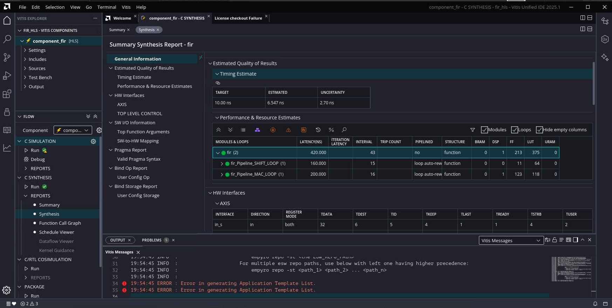
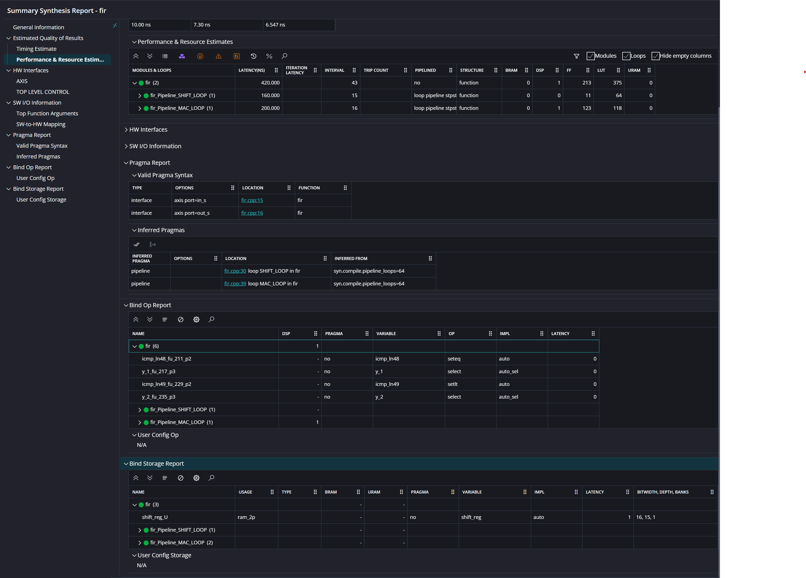

# Lab 6 — FIR Filter HLS Optimization

## Learning Objectives

By the end of this lab you will be able to:

- Read Vitis HLS synthesis reports and understand loop-latency and initiation-interval (II) numbers
- Identify the root cause of high latency in a pipelined/unrolled loop
- Apply HLS pragmas incrementally and understand what each one fixes
- Use HLS pargmas to achieve **II = 1 for the fir function**, meaning the design can accept one new sample every clock cycle
- Use HLS pragmas to optimize resource usage and area of the FIR filter while balancing performance

## Submission

Each part will have a set of questions. Write the answers down in the solutions.md file in the 'solutions' folder. For each step submit your modificaaoins to `fir.cpp` as `fir_step<i>.cpp` file with the pragmas changes.

---

## Background

### What is Latency and II?

| Term | Meaning |
|------|---------|
| **Latency** | Total clock cycles from first input to last output for one invocation |
| **Loop Iteration Latency** | Cycles to complete one iteration of a loop body |
| **Loop II (Initiation Interval)** | Cycles before a new loop *iteration* can start |
| **Function II** | Cycles before a new function *call* can start (= throughput) |

A pipelined loop with II = 1 means a new loop iteration starts *every* cycle.  
A function with II = 1 means a new input sample is accepted *every* cycle — maximum throughput.

### The FIR Algorithm

This design implements a 15-tap direct-form FIR filter.  
One function call processes **one sample**:

```
1. Read x from AXI-Stream input
2. Shift the delay line:  shift_reg[14..1] = shift_reg[13..0]
3. Insert new sample:     shift_reg[0] = x
4. Compute dot product:   acc = SUM(coeff[i] * shift_reg[i]) for i = 0..14
5. Scale and clamp output
6. Write y to AXI-Stream output
```

---

## Files Provided

| File | Purpose |
|------|---------|
| `fir.cpp` | Design source — **this is where you add all pragmas** |
| `fir.h` | Header: `NUM_TAPS = 15`, `packet` type, function declaration |
| `fir_test.cpp` | Testbench |
| `input.txt` | 32 test samples |
| `golden.txt` | Expected output |
| `run_hls.tcl` | TCL script to run csim + csynth + cosim |

Please read through the files to understand the design, testbench, and how to run synthesis.

---

## How to Run Synthesis

Open a terminal in the **fir_hls** project directory and run:

```bash
module load FPGA/Vitis
```

```bash
vitis-run --mode hls --tcl run_hls.tcl
```

This will:
1. Run C simulation (`csim_design`) — checks functional correctness
2. Run HLS synthesis (`csynth_design`) — generates the report you will analyse
3. Run co-simulation (`cosim_design`) — RTL-level verification
4. Export the IP

> **Tip:** To iterate quickly, you can temporarily set `set hls_export_ip 0` in `run_hls.tcl` to skip cosim and export during early optimization steps.

---

## How to Open the Vitis HLS GUI

After synthesis completes, open the GUI for visual inspection:

```bash
vitis-ide .
```

Run this command from inside `fir_hls`. The GUI opens with the `component_fir` component already loaded.

### Navigating to the Synthesis Report

1. In the **Explorer** panel (left), expand `C SYNTHESIS --> PERPOTS --> Synthesis`



### Finding the Loop Latency Table

In the Synthesis Summary, scroll to the section **"Loop Summary"**. This table shows:

| Column | Meaning |
|--------|---------|
| `Loop Name` | The label you gave the loop in C (`MAC_LOOP:`) |
| `min / max Latency` | Range of iteration latency in cycles |
| `Iteration Latency` | Cycles for one loop body execution |
| `Initiation Interval` | II — cycles between successive iterations starting |
| `Trip Count` | Number of iterations (15 for MAC_LOOP) |
| `Pipelined` | `yes` if `#pragma HLS PIPELINE` was applied |

### Synthesis Report Details

After reviewing the Loop Summary, scroll down (or use the left panel) to examine three additional sub-reports. **Record these for every synthesis run** — they are essential for understanding what the tool is doing and where bottlenecks come from.



---

#### Pragma Report

The Pragma Report is divided into two sub-sections:

**Valid Pragma Syntax**

This table lists every `#pragma HLS` directive the tool successfully parsed from your source code. Key columns:

| Column | Meaning |
|--------|---------|
| `Type` | Pragma category (e.g., `interface`, `pipeline`, `array_partition`) |
| `Options` | The arguments you supplied (e.g., `axis port=in_s`) |
| `Location` | Source file and line number where the pragma appears |
| `Function` | The function it applies to |

Use this to confirm that every pragma you wrote was recognized. If a pragma you added does not appear here, the tool ignored it (likely a typo or wrong scope).

**Inferred Pragmas**

This table shows pragmas the tool inserted automatically based on configuration — not ones you wrote. Key columns:

| Column | Meaning |
|--------|---------|
| `Inferred Pragma` | Type inferred (e.g., `pipeline`) |
| `Location` | Loop or function where it was applied |
| `Inferred From` | The setting that triggered it (e.g., `syn.compile.pipeline_loops=64`) |

> **Note:** In the baseline run, you may see inferred `pipeline` pragmas on loops even without adding them yourself. This is the tool's default auto-pipeline setting. Note whether this changes as you add explicit pragmas.

---

#### Bind Op Report

The Bind Op Report shows how each arithmetic/logic operation in your design is mapped to hardware resources. Key columns:

| Column | Meaning |
|--------|---------|
| `Name` | Internal operation name generated by HLS |
| `DSP` | Number of DSP blocks used by this operation |
| `Pragma` | Whether a `BIND_OP` pragma was applied (`yes`/`no`) |
| `Variable` | The C variable this operation corresponds to |
| `Op` | Operation type (e.g., `mul`, `add`, `icmp`, `select`) |
| `Impl` | Implementation chosen (e.g., `auto`, `dsp48`, `fabric`) |
| `Latency` | Clock cycles the operation takes |

Expand each function/loop entry to see its individual operations. For the FIR filter, pay attention to:
- The **multiply-accumulate** in `MAC_LOOP` — does it map to a DSP block (`DSP > 0`)?
- The `Impl` column — `auto` means the tool decided; `dsp48` means it explicitly uses a DSP element.

> **Record:** How many total DSPs are used? Which operations consume them? Does adding `PIPELINE` or `UNROLL` change DSP usage?

---

#### Bind Storage Report

The Bind Storage Report shows how arrays in your C code are mapped to memory resources in hardware. Key columns:

| Column | Meaning |
|--------|---------|
| `Name` | Internal memory instance name |
| `Usage` | Memory port type (e.g., `ram 2p` = dual-port RAM) |
| `Type` | Memory category (`BRAM`, `URAM`, `FF`, or distributed RAM) |
| `Pragma` | Whether an `ARRAY_PARTITION` or `BIND_STORAGE` pragma was applied |
| `Variable` | The C array this storage corresponds to |
| `Impl` | Implementation chosen (e.g., `auto`, `bram`, `lutram`) |
| `Latency` | Read latency in cycles |
| `Bitwidth, Depth, Banks` | Data width, number of elements, and number of memory banks |

---

## Alternative Method To View Synthesis Report Without Using Vitis HLS GUI

You can examine the synthesis report directly at `component_fir/hls/syn/report/csynth.rpt` to check the various sections shown in the GUI.

## Step 0 — Baseline: No Pragmas

### What the code looks like

```cpp
// fir.cpp (starting state — no optimization pragmas on loops)

static const ap_int<16> coeff[NUM_TAPS] = { ... }; 

void fir(hls::stream<packet>& in_s, hls::stream<packet>& out_s) {
    #pragma HLS INTERFACE axis port=in_s
    #pragma HLS INTERFACE axis port=out_s
    // NOTE: no function-level pragma yet

    static ap_int<16> shift_reg[NUM_TAPS];

    // ... read, shift ...

    ap_int<32> acc = 0;
    MAC_LOOP:
    for (int i = 0; i < NUM_TAPS; i++) {
        // NOTE: no pragma on loop yet
        ap_int<32> prod = coeff[i] * shift_reg[i];
        acc += prod;
    }
    // ...
}
```

### Run synthesis and read the report

Run synthesis and open the report in GUI. In the **Loop Summary** you will see `MAC_LOOP` is **not pipelined**.

**Questions to answer:**

**Performance (Loop Summary & top-level table)**

1. What is the `Iteration Latency` and `Initiation Interval` of `SHIFT_LOOP`? 
1. What is the `Iteration Latency` and `Initiation Interval` of `MAC_LOOP`?
2. What is the total `Latency` (min/max) and `Interval` of the whole `fir` function?
3. Why is the `MAC_LOOP` using only one DSP? (Hint: Refer to the HLS lecture slides on latency optimization section)

**Operation Binding (Bind Op Report — expand `MAC_LOOP`)**

4. For the `MAC_LOOP`, how many operations are needed? Why? For each, record: what resource it is bound to (`Impl`), whether a DSP is used, and what its operator latency is.

**Storage Binding (Bind Storage Report)**

5. What arrays exist in the design? For each array, record: what memory type it is bound to (e.g., BRAM, LUTRAM, FF), what port configuration is used (e.g., `ram 2p/1p`), and its bitwidth, depth, and number of banks.
6. What is the total resource usage of the whole `fir` function (DSP, LUT, FF, BRAM)?

---

## Step 1 — Unroll SHIFT_LOOP (First Attempt)

### What `UNROLL` does on SHIFT_LOOP

The `SHIFT_LOOP` is a sequential loop that shifts data through the register:

```cpp
SHIFT_LOOP:
for (int i = NUM_TAPS - 1; i > 0; i--) {
    shift_reg[i] = shift_reg[i - 1];
}
```

By default, this loop takes **NUM_TAPS - 1 = 14 cycles** (one iteration per cycle). 

### Add UNROLL pragma to SHIFT_LOOP to eliminate this bottleneck

Edit `fir.cpp`. Add the pragma inside `SHIFT_LOOP`:

```cpp
SHIFT_LOOP:
for (int i = NUM_TAPS - 1; i > 0; i--) {
    #pragma HLS UNROLL   // ← add this
    shift_reg[i] = shift_reg[i - 1];
}
shift_reg[0] = x;
```

### Run synthesis and check the report

Look at the **Loop Summary** table in the synthesis report.

**Questions to answer:**

1. Does `SHIFT_LOOP` still appear in the Loop Summary? 
2. What is the total `Latency` and `Interval` of the whole `fir` function after optimization?
3. Compare it to the baseline latency from Step 0. Did it decrease by ~14 cycles (the original SHIFT_LOOP latency)?
4. You may notice that **the function latency barely changed**, even though you unrolled the loop. Why? (Hint: Look at the **Bind Storage Report**)
5. Find a way to eliminate the remaining latency from SHIFT_LOOP. (Hint: Figure what pragma to add based on the previous step's answer)
6. What is the total `Latency` and `Interval` of the whole `fir` function after optimization? How much did it reduce compared to baseline?
7. What is the total resource usage of the whole `fir` function (DSP, LUT, FF, BRAM)? What is the biggest change and why?


## Step 2 — Optimize the MAC_LOOP


UNROLL the MAC_LOOP as well to eliminates the loop entirely — all 15 MACs are instantiated in parallel hardware.

### Run synthesis and read the report

After synthesis you will notice that `MAC_LOOP` **no longer appears in the Loop Summary table** — because it has been fully unrolled into inline logic. There is no loop to report.

**Questions to answer:**

1. Does `MAC_LOOP` still appear in the Loop Summary?
2. What is the total `Latency` and `Interval` of the whole `fir` function after optimization? How much did it reduce compared to previous step?
3. What is the total resource usage of the whole `fir` function (DSP, LUT, FF, BRAM)? What is the biggest change and why?
4. For full rolling, we expect 15 MACs to be instantiated. Does the report show this? If not, why?
5. Why is the function Interval still > 1? (Hint: Refer to the HLS lecture slides on throughput optimization section)

---

## Step 3 — Achieving II = 1 for FIR function


Add `PIPELINE II=1` pragma to the function body. Run synthesis.

**Questions to answer:**

1. What is iteration `Interval` of the whole `fir` function after optimization?
2. What is the total resource usage of the whole `fir` function (DSP, LUT, FF, BRAM)? What is the biggest change and why?

Now comment out all other pragmas (except the function level `PIPELINE II=1` pragma) and run synthesis again. 

3. What is the iteration `Interval` now? Is it still 1? If so why? (Hint: Refer to the HLS lecture slides on throughput optimization section)

Now what if I wanted to limit the number of DSPs used to control the resources for a more area-constrained implementation? 

4. Use the `ALLOCATION` pragma to limit the number of DSPs used to 2. Run synthesis.
5. What is your expected II for the `fir` function? What is the actual II in the synthesis report?


---

## Step 4 — Verify with Co-simulation

Co-simulation re-runs the testbench against the **RTL-level** model to confirm that the pipelined hardware produces identical outputs to the C golden reference.

In `run_hls.tcl`, ensure `set hls_export_ip 1` (which enables cosim). Run:

```bash
vitis-run --mode hls --tcl run_hls.tcl
```

A passing co-simulation confirms that your pragma changes did not break the filter's arithmetic correctness despite the deep pipelining. This will export a AXI Stream IP (`hls/impl/export.zip`) that can be used in Vivado similar to the previous FIR lab.

---

## Pragma Reference

Documentation: https://docs.amd.com/r/en-US/ug1399-vitis-hls/HLS-Pragmas

```cpp
// Partition array
#pragma HLS ARRAY_PARTITION variable=<array_name> type=<complete|cyclic|block> factor=<N> dim=<1|2|3|...>
// Disable array partitioning for specific variable & specified dimensions
#pragma HLS ARRAY_PARTITION variable=<array_name> type=<complete|cyclic|block> factor=<N> off=true 

// Pipeline pragma: start a new iteration every II cycles
#pragma HLS PIPELINE II=<target_II>

// Unroll a loop: instantiate all iterations as parallel hardware
#pragma HLS UNROLL

// Bind an operation to a specific implementation with a given latency
#pragma HLS BIND_OP variable=<result_var> op=<mul|add> impl=<DSP|fabric> latency=<N>

// Allocate a specific number of instances of a function or operation
#pragma HLS ALLOCATION operation instances=<mul|add> limit=<N>
#pragma HLS ALLOCATION function instances=function_name limit=<N>
```

---


